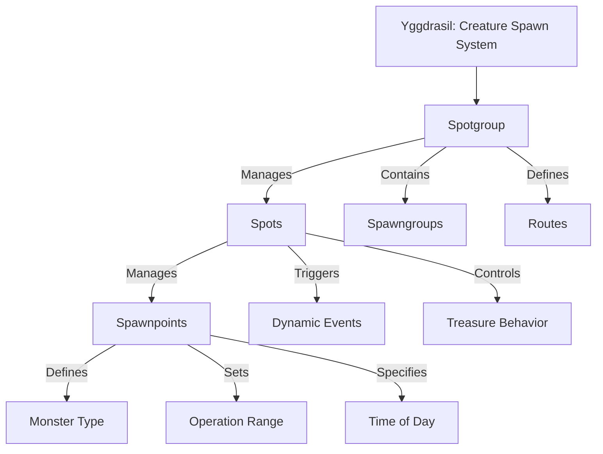

# Projeto Servidor Ultima Online - Sussurros Eternos 2020

Bem-vindo ao repositório do Projeto Servidor Ultima Online - Sussurros Eternos 2020. Este projeto é desenvolvido com a engine POL v100 e tem como objetivo criar uma experiência imersiva de roleplay em Ultima Online.

# Roadmap 2024
Novos sistemas e funcionalidades que serão implementados no servidor para lançamento no Q2 de 2024.

Você pode acompanhar o status de desenvolvimento de cada funcionalidade:
- [Sistemas em Desenvolvimento](https://sharing.clickup.com/9017136554/l/h/8cqd5da-417/b6dc7e0b1e0f2bd)
- [Classes e Sub-Classes em desenvolvimento](https://sharing.clickup.com/9017136554/l/h/8cqd5da-737/93ac78aa702e11d)

## Sumário
- [Características Principais](#características-principais)
- [Filosofia do Projeto](#filosofia-do-projeto)
- [Convenções do Projeto](#convenções-do-projeto)
- [Estrutura de Arquivos](#estrutura-de-arquivos)
- [Pacotes Importantes](#pacotes-importantes)
- [Pacotes Auxiliares](#pacotes-auxiliares)
- [Pacotes em Desenvolvimento](#pacotes-em-desenvolvimento)
- [Instruções de Instalação](#instruções-de-instalação)
- [LSP Plugin para VSCode](#lsp-para-vscode)

## Características Principais

- **Sistema Baseado em D&D 5e**: Incorporamos um sistema de rolagem de dados dinâmico que inclui D20, D10, D6 e D4, proporcionando uma experiência de jogo rica e variada.
- **Benchmarking**: Otimizado para suportar até 60 jogadores simultâneos, garantindo desempenho e estabilidade.

## Filosofia do Projeto

Nosso servidor é projetado para dar aos GMs (Game Masters) e jogadores um alto nível de controle sobre a criação de conteúdo. Isso significa que:

- **Criação Flexível de Monstros**: Utilizamos um sistema onde os monstros podem ser criados diretamente pelos usuários através de gumps e armazenados em datafiles.
- **Sistema de Respawn Yggdrasil**: Nosso sistema de respawn exclusivo, Yggdrasil, oferece uma abordagem personalizada e integrada ao nosso mundo de jogo. Ele permite um controle refinado sobre a frequência e localização dos respawns.
- **Controle de Recursos Yggdrasil**: Nosso sistema Yggdrasil permite que todos os recursos de coleta sejam gerenciados diretamente através do cliente. Isso proporciona aos jogadores uma experiência de coleta de recursos mais imersiva e personalizada, que pode mudar através do tempo.
- **Controle de Drops Yggdrasil**: Com o Yggdrasil, os drops de monstros são gerenciáveis através do cliente. Oferecemos pacotes pré-prontos que podem ser modificados para se adequar às necessidades específicas do servidor.
- **Controle de IA Ghaia**: Ghaia é nosso sistema de inteligência artificial avançado para mobs. Embora seja um recurso pesado, ele proporciona uma complexidade sem precedentes no comportamento dos mobs.

---

## Convenções do Projeto

Para garantir a consistência e a legibilidade do código em todo o projeto, adotamos as seguintes convenções de código:

1. **Documentação de Código**: Cada arquivo .inc deve conter um cabeçalho com a descrição das funções incluídas no arquivo. Por exemplo:

```polscript
/**
 * [Commands for SpawnGroups]
 * LoadQuestData() - Get the DataFile document
 * SetSpawnGroupData(group_name, group_struct) - Set changes to a group;
 * GetSpawnGroupData(group_name) - Get all info about a group;
 * RemoveGroupData(group_name) - Remove a group;
 * RemoveGroupMobData(group_name, index_mob) - Remove a mob from mobList. Need index;
 * UpdateGroupMobData(group_name, mob_struct, index) - Update all informations about a mob.
 */
```

2. **Nomenclatura de Funções**: Os nomes das funções devem ser intuitivos e refletir o tipo de retorno da função. Por exemplo:
```polscript
// A função retorna um valor booleano
// Correto:
isUserFrozen() // return true

// Errado:
userFrozen() // return true
```

3. **GUMP IDs**: Ao implementar novos Gumps, certifique-se de que cada Gump tenha seu próprio GUMP ID. O ID do gump deve ser especificado na constante de GUMPS em `scripts/include/client.inc`.

---


## Estrutura de Arquivos
A arquitetura de um projeto é fundamental para o seu sucesso. Ela define a estrutura do projeto e facilita a compreensão do fluxo de trabalho. Uma boa arquitetura permite que os desenvolvedores encontrem facilmente o que precisam e entendam como tudo se encaixa. A seguir, apresentamos a estrutura de arquivos do nosso projeto.

- `./dev`: Contém arquivos auxiliares não utilizados pelo servidor.
- `./pkg`: Este é um diretório principal que contém vários subdiretórios e arquivos relacionados a diferentes aspectos do jogo/servidor.
   - `./pkg/items`: Inclui itens usados no jogo, categorizados em vários tipos como jogos, champspawn, itens destrutíveis, armadilhas, quadros de avisos, etc. Cada categoria tem seus próprios subdiretórios para tipos de itens específicos ou scripts relacionados.
   - `./pkg/systems`: Contém diferentes sistemas usados no jogo, como criação de personagens, sistemas de loot, crafting e mais. Cada sistema está organizado em seu próprio subdiretório.
   - `./pkg/utils`: Contém scripts e arquivos de utilidade que auxiliam em várias funcionalidades como gumps, controles, coordenadas, etc.
   - `./pkg/commands`: Consiste em diferentes comandos categorizados por função do usuário (jogador, vidente, administrador, etc.).
   - `./pkg/multis`: Contém arquivos relacionados a estruturas multi-objetos como casas ou barcos.
   - `./pkg/skills`: Contém arquivos e scripts relacionados a várias habilidades do jogador no jogo.
   - Outros diretórios de itens específicos como montarias, comida, etc., cada um com sua própria estrutura e potencialmente contendo comandos, configurações e arquivos de inclusão.
   - `./pkg/mobiles`: Inclui scripts e arquivos relacionados a mobiles (NPCs, criaturas) no jogo, categorizados por sua funcionalidade.
- `./scripts`: Contém vários scripts POL-CORE usados no projeto, possivelmente incluindo funcionalidades principais, módulos e outros scripts diversos.
- `./regions`: Contém vários scripts de configuração POL-CORE para dados específicos de região.
- `./config`: Contém várias configurações globais POL-CORE para o servidor.
- `./node_service`: Contém scripts NodeJS para gerenciamento do servidor.

---

## Pacotes Importantes
Descrição de packages importantes deste servidor e onde localizar sistemas especifícos.

- **yggdrasil**: Este é o sistema mais importante relacionado à inteligência de gerenciamento do shard.
   - `.spawns`: Acesso ao sistema de spawnpoints da ghaia.
   - `.dynamicevents`: Acesso ao sistema de eventos dinâmicos da ghaia.
   - `.editgroups`: Acesso ao sistema de criação de grupos de monstros da ghaia.
   - `.combatevents`: Acesso ao sistema de habilidades de monstros. Permite criar habilidades e importar em monstros. Alterar a habilidade no combatevents afeta todos os monstros que possuem a habilidade.
   - `.reagentspawn`: Acesso ao sistema de spawn de itens no mapa.
   - `.fishspots`: Acesso ao sistema de spawn de peixes.




- **ghaia**: Este é o sistema de AI do shard, controlando todos os tipos de NPCs autônomos e pets.
   - `.createnpc`: Spawn de NPCs.
   - `.criartemplate`: Acesso ao sistema de criação de templates de npc.

- **faccao**: Sistema que implementa gerenciamento de facções por players e utiliza includes ghaia para gerenciamento de AI.
   - `.faccoes`: Acesso ao sistema de facções.

- **quest**: Sistema de gerenciamento de quests automáticas, podendo fazer quest de evento único ou repetíveis.
   - `.questmaker`: Acesso ao sistema.

- **roleplay_window**: Objeto interativo para exibir textos ou imagens. Usuários podem acessar ao clicar ou se posicionar próximo ao objeto.

- **nature**: Sistema legado para gerenciamento de clima.

- **email**: Sistema de caixa de mensagens para notificar jogadores de eventos importantes out-of-game.

- **charactercreation**: Sistema de criação de personagem. Inclui dependências usadas por muitos scripts, e configurações de feats, perícias e habilidades.

- **combat**: Sistema de combate, com todas as regras PvE, PvP e feats de combate.

- **vitals**: Sistema que gerencia vida, mana, stamina, death points e progressão de experiência.

- **gathering**: Sistema de coleta de recursos baseado em veios. É necessário criar o item 0xee99 para adicionar minérios as minas.

- **auxsvc**: Sistema de auxiliar TCP/IP para conectar com serviços externos. Porta 2973.

---

## Pacotes Auxiliares
Aqui estão alguns pacotes auxiliares que podem ser utilizados em outros pacotes:

- `include/arrays`: Este pacote é um wrapper para o tratamento de Arrays, como ordenação, cópia, etc.
- `include/facings`: Este pacote é um wrapper para capturar a direção em que os mobiles estão olhando.
- `include/say`: Este pacote é um wrapper para enviar mensagens para os jogadores.
- `include/shapes`: Este pacote é um wrapper para capturar coordenadas de diferentes geometrias ao redor de um ponto.
- `include/client`: Este pacote contém uma lista de constantes para serem usadas em diversos scripts.
- `gump`: Este pacote contém diversos wrappers para a construção de gumps.

---

## Pacotes em Desenvolvimento

- **architect**: Sistema de construção projetado para facilitar a construção de staff dentro do jogo. Planejado para expansão futura para os jogadores.
- **contract**: Sistema destinado a facilitar contratos entre jogadores.
- **heir**: Sistema de herança não finalizado.
---

## Instruções de Instalação

1. Baixe a versão do POL correspondente ao seu sistema operacional em [POL Server](https://github.com/polserver/polserver/releases).
2. Extraia o arquivo em uma pasta separada.
3. Copie as seguintes pastas e executáveis para a pasta do projeto:
   - pol
   - poltool
   - uoconvert
   - uotool
   - scripts/ecompile
   - scripts/modules/

   **Nota:** Não copie nenhum outro arquivo, pois são arquivos de configuração.

4. Abra o arquivo pol.cfg e altere UoDataFileRoot para o caminho do seu Ultima Online com os arquivos do shard.
  - Se estiver usando Linux, instale a libmysqlclient2 com o comando `apt-get install libmysqlclient2`.
6. Carregue o mapa do servidor usando o uoconvert com os seguintes comandos:
   - `./uoconvert map     realm=britannia mapid=0 usedif=1 width=6144 height=4096`
   - `./uoconvert statics realm=britannia`
   - `./uoconvert maptile realm=britannia`

7. Crie uma cópia da pasta dev/data/ para a pasta raiz. Altere as informações no arquivo /data/accounts.txt para criar sua conta.
   - A senha da conta é 123. Não altere o hash!
8. Para compilar todos os scripts, abra o terminal na pasta do projeto e execute o comando `scripts/ecompile -a`.

Agora você está pronto para iniciar seu servidor Ultima Online!

---

## LSP para vsCode

Siga as instruções abaixo para instalar o LSP do POL para o vscode:

1. Baixe o release em [POL Server LSP](https://github.com/polserver/vscode-escript).
2. Descompacte o arquivo e instale o VSIX arrastando-o para o vscode.
3. Para que o LSP funcione corretamente, é necessário que o arquivo `scripts/ecompile.cfg` esteja preenchido corretamente. Se houver algum problema, tente usar o caminho absoluto das pastas.
4. Recarregue o vscode ou feche e abra novamente.