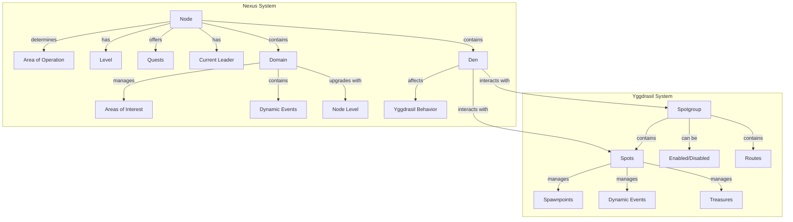

```mermaid
flowchart TB
    subgraph Yggdrasil ["Yggdrasil System"]
        SG["Spotgroup"] -->|contains| S["Spots"]
        S -->|manages| SP["Spawnpoints"]
        S -->|manages| DE["Dynamic Events"]
        S -->|manages| T["Treasures"]
        SG -->|can be| EAD["Enabled/Disabled"]
        SG -->|contains| R["Routes"]
    end

    subgraph Nexus ["Nexus System"]
        N["Node"] -->|determines| AOO["Area of Operation"]
        N -->|has| L["Level"]
        N -->|offers| Q["Quests"]
        N -->|has| CL["Current Leader"]
        N -->|contains| D["Domain"]
        D -->|manages| AOI["Areas of Interest"]
        D -->|contains| DDE["Dynamic Events"]
        D -->|upgrades with| NL["Node Level"]
        N -->|contains| DN["Den"]
        DN -->|affects| YB["Yggdrasil Behavior"]
    end

    DN -->|interacts with| SG
    DN -->|interacts with| S

    class Yggdrasil,Nexus system;
```