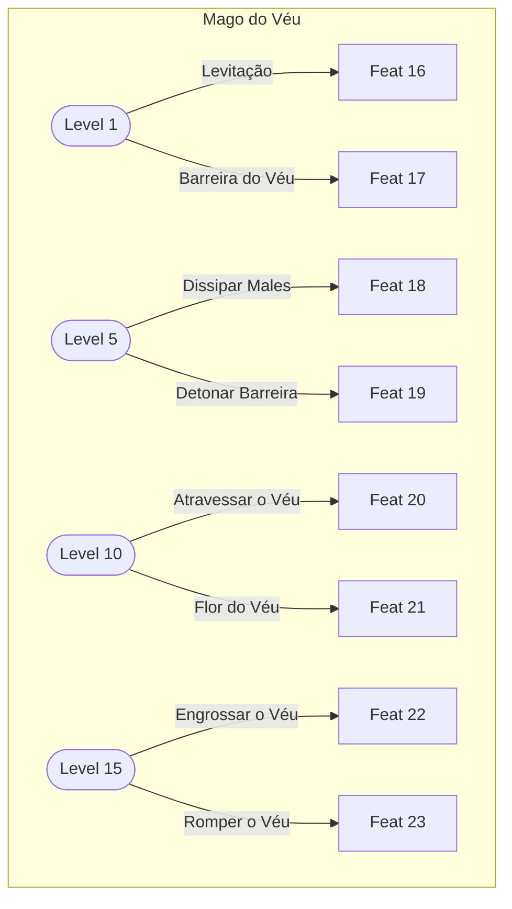

# Habilidades Iniciais de Classe
## Guerreiro
Armas: Espadas, Arcos, Machados, Armas de Concussão, Armas Gigantes, Lâminas Curtas, Lança e Alabarda
Armaduras: Armadura Leve, Armadura Pesada e Escudos
Habilidade: Fôlego Extra
- Recupera 40% da stamina. 
- CD 10 min

## Ladino
Armas: Lâminas Curtas, Armas Duplas, Espadas, Arcos, Balestras
Armaduras: Armadura Leve
Habilidade: Ataque Furtivo
- Atacar um alvo em modo furtivo aumenta o dano em 15%
- CD 15s

## Clérigo
Armas:  Armas de Concussão, Lâminas Curtas, Espadas, Arcos
Armaduras: Simbolo Divino, Armadura Leve, Armadura Pesada
Habilidade: Resistência
- Alvo recebe 1d4 em testes de resistência por 15 min
- CD 2 min

## Bardo
Armas: Lâminas Curtas, Balestras, Espadas e Arcos
Armaduras: Armadura Leve
Habilidade: Inspiração de Bardo
- Alvo recebe 1d6 na próxima rolagem de dados.
- Náo pode usar em si mesmo.
- CD 1 min

## Elementalista
Armas: Varinhas, Cajados e Balestras
Armaduras: Nenhuma
Habilidade: Recuperação Arcana
- Recupera 40% da mana. CD de 5 min

## Invocador
Armas: Cajados, Varinhas, Lâminas Curtas
Armaduras: Armadura Leve
Habilidade: Invocar Familiar
- Invoca um familiar de luz que o acompanha por 30 min.
- O familiar pode ser usado como fonte de calor.
- CD 10 min

## Druida
Armas: Cajados, Lâminas Curtas, Armas de Concussão
Armaduras: Armadura Leve, Símbolos Naturais
Habilidade: Forma Selvagem
- Transforma-se em um coelho, rato ou galinha, ganhando habilidades únicas por 5 minutos.
- Enquanto transformado, recupera 1d10 de vida a cada 30 segundos.
- CD 20 min

# Habilidades de Classe

# Habilidades de Sub-classe

